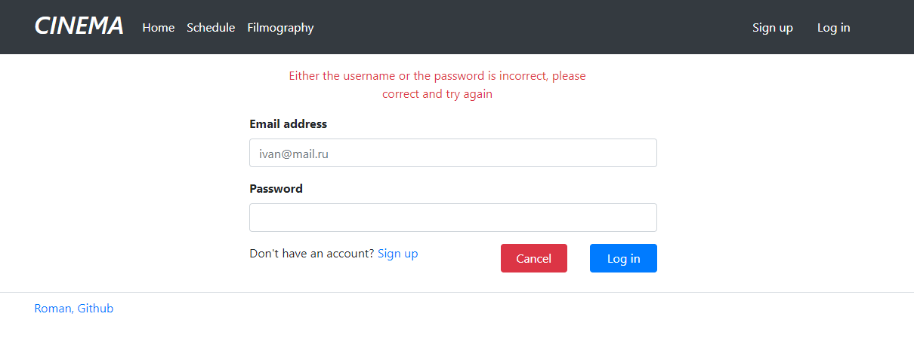

# Cinema

Project Cinema is an application for purchasing cinema tickets.

**The main logic of the App:**

* User registration, log in, log out
* Displaying all film sessions
* Displaying all films
* Displaying information about selected session
* Purchasing tickets

**Separation of Rights:**

* All users have the right to view information on the site.
* Only registered users can buy tickets. If a user is not registered and clicks on the "Buy ticket" button, he/she is
  redirected to the login page.

**The database is implemented with the following tables:**

* All tables except tickets and users are filled with SQL scripts and Liquibase.

* files - file storage information for film posters
* genres - film genres
* halls - cinema halls
* films - films for distribution
* film_sessions - available sessions
* users - users registered on the site
* tickets - tickets already purchased for certain film sessions

**Used technologies:**
* Java 17
* Maven
* PostgreSQL
* Spring Boot
* Lombok
* Junit 5
* AssertJ
* Mockito
* Liquibase
* Sql2o
* H2database
* Thymeleaf
* Bootstrap
* Checkstyle
* JoCoCO

**How to run the project:**

- To run the project, you need to clone the project from this repository;
- Then you need to create a local database "cinema";
- Specify the login and password for the database you created in the db/liquibase.properties file;
- Run liquibase to pre-create and autofill tables;
- Launch the application through the Main class, located in the folder src\main\java\ru\job4j\cinema\Main;
- Open the page http://localhost:8080/index in the browser;

---

**Application screenshots**

